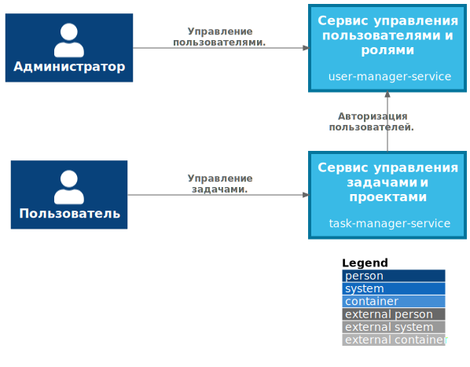
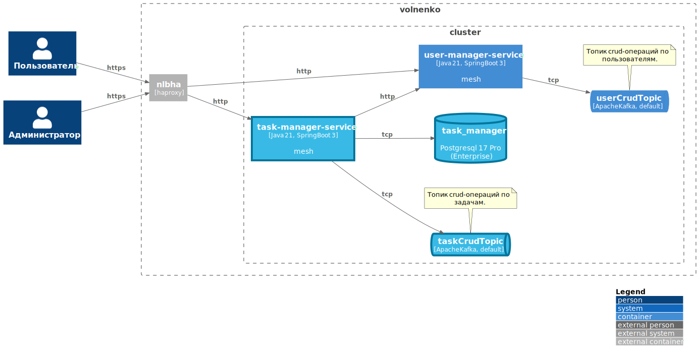

= [Архитектурный документ]
:sectnums:
:toc:
:toc-title: Оглавление

include::include/vocabulary.adoc[]

== Контекстное представление

== Логическое представление

include::include/components.adoc[]

